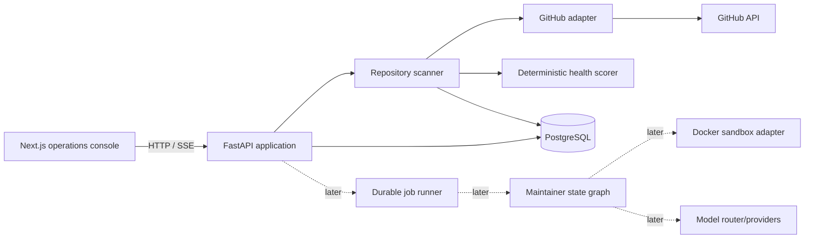
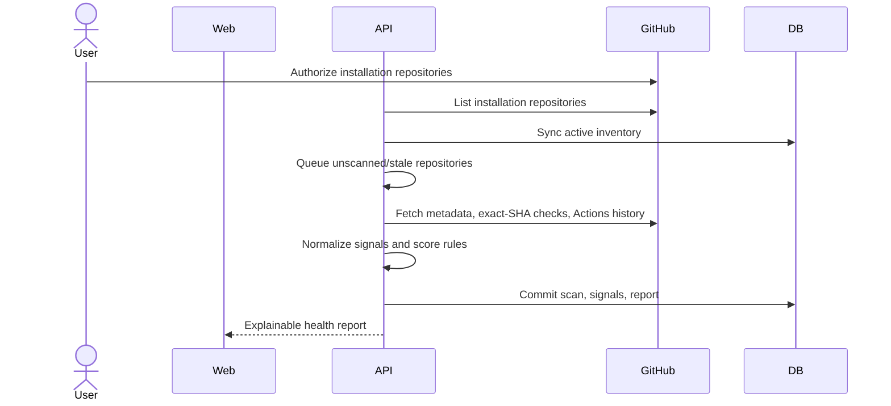
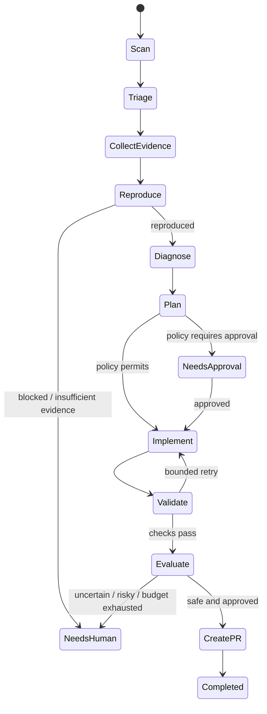

# Initial architecture

## Goals

Build a single-developer operations console that observes explicitly authorized GitHub repositories, produces explainable and historically comparable health reports, and later runs bounded maintenance workflows. Every conclusion must link to evidence; every autonomous action must be policy-checked and auditable.

## Non-goals

- Multi-tenancy, billing, teams, RBAC, or a marketplace.
- Automatic merging, direct default-branch pushes, secret management, or production mutation.
- Kubernetes, arbitrary hosting-provider inference, or autonomous code changes in Milestone 1.
- Treating an LLM narrative as evidence or a health score as an objective truth.

## Architectural decisions

1. **Modular monolith first.** One FastAPI service owns HTTP, scanning, scoring, and persistence. A separately deployable worker is deferred until scans outgrow an in-process job boundary. Modules retain explicit ports so extraction is mechanical.
2. **PostgreSQL is the system of record.** Repository observations and derived reports are immutable snapshots. Current state is a query over the latest snapshot, not mutable truth copied into several stores.
3. **Deterministic collection and scoring precede AI.** Milestone 1 contains no model dependency. LLM output will later create typed hypotheses and plans, never raw authority.
4. **A durable state machine, not a conversational swarm.** A single maintainer workflow with specialized nodes will be introduced for diagnosis. Checkpoints and events make interruption and recovery explicit.
5. **GitHub App authentication is the production target.** Fine-grained installation access, short-lived tokens, explicit repository selection, and auditable permissions fit the product better than a broad personal token. A read-only token adapter may support local development.
6. **SSE for live events.** Execution is server-to-client streaming with normal HTTP commands for pause/stop/approve; WebSockets add no current benefit.
7. **Docker is an execution backend, not a security boundary.** Later repository execution runs in disposable, non-root containers with resource/network/mount controls. The application never mounts the Docker socket into a repository container.

## Components

- **API:** validation, authorization boundary, repository and scan resources.
- **GitHub adapter:** typed external API boundary, pagination/rate-limit handling, and normalized observations.
- **Scanner:** invokes collectors, preserves unavailable/unknown signals, and writes one atomic scan snapshot.
- **Health scorer:** versioned, deterministic rules that produce contributions plus evidence references.
- **Web:** command center, repository inventory, detail, and scan history; no chat as the primary object.
- **Telemetry:** structured logs, trace correlation, and a deliberately small metric set.

## Milestone 1 data flow

External results are timestamped observations. API failure yields `unavailable`; absence of configured deployment data yields `unknown`. Neither is silently converted to healthy.

## Future maintainer state machine

State is typed and durable: repository/base SHA, problem, evidence, hypotheses, reproduction, plan, workspace, changes, validations, evaluation, model decisions, cost/budget, policy decisions, and status. Each transition appends a structured run event in the same transaction as its checkpoint.

## Security and autonomy

Repository content, issue text, logs, and build output are untrusted data. They are delimited and labeled before model use, cannot redefine system policy, and are secret-redacted. Provider contexts use an allowlist; repository or host credentials never enter prompts.

Policy is code with three outcomes: `ALLOW`, `REQUIRE_APPROVAL`, and `DENY`. Initially reads, temporary workspaces, and validation are allowed; PR creation requires explicit approval; auth, schema, infrastructure, security-sensitive, large, and major-version changes require approval; merging, force-pushing, default-branch writes, secret/access changes, and destructive repository operations are denied.

Before PR creation the workflow compares the recorded base SHA with the current default-branch SHA and revalidates or marks the run stale. Every GitHub write uses an idempotency key and a dedicated branch namespace.

## Repository execution isolation

The future `Sandbox` port exposes prepare, execute, collect-artifact, and destroy operations. The Docker implementation uses an immutable checkout at an exact SHA, non-root UID, read-only root filesystem where possible, writable disposable work volume, dropped capabilities, no host/socket mounts, PID/CPU/memory/disk/time limits, and denied network by default. Dependency installation can use an explicitly enabled, logged egress phase.

Existing repository container configuration is inspected and used only after policy checks. Generated execution Dockerfiles live outside the checkout and are never proposed as source changes by default. Docker does not defend against every kernel/container escape; stronger remote microVM isolation is a future backend.

## Model routing

No model is called in Milestone 1. Later a provider-neutral router maps a versioned `TaskComplexity` feature record to fast, standard, or reasoning capability tiers. Inputs include category/severity, reproduction status, repository/context size, affected scope, dependency count, tools, failed attempts, and historical outcomes. Every decision records features, score, reasons, selected model, prices, tokens, latency, validity, retries, confidence, and escalation.

Escalation is bounded and triggered by explicit conditions such as invalid structured output, tool failure, or confidence below policy threshold. Per-run cost, high-tier-call, duration, and repair-attempt budgets terminate in `NEEDS_HUMAN`, never an infinite loop.

## Observability

- JSON logs with request, repository, scan, problem, and run correlation IDs; central redaction.
- OpenTelemetry traces across HTTP, GitHub calls, scans, database work, and later sandbox/model calls.
- Initial metrics: scan count/duration/failure, GitHub request/rate-limit failure, problems detected, and health by dimension. Later add reproduction, validation, safe-fix, PR, model latency/token/cost, and escalation metrics.
- Structured domain events back timelines and SSE; raw logs remain artifacts, not the UX.

## Initial data model

- `repositories`: authorized GitHub identity, installation reference, default branch, optional deployment configuration, monitoring state.
- `repository_scans`: immutable scan header, commit SHA, timing, overall score/status, scorer version.
- `health_signals`: dimension, status (`pass/fail/unknown/unavailable`), normalized value, summary, evidence reference, observed time.
- `score_contributions`: rule ID, dimension, points, explanation, evidence reference.

Milestone 2 adds problems, evidence, and run events. Maintenance runs/checkpoints, hypotheses, workspaces, changes, validations, evaluations, PRs, and model invocations are added with the workflows that need them rather than as empty tables now.

## MVP boundary and tradeoffs

Milestone 1 ends at read-only GitHub repository visibility, automatic/manual scans, CI observations, explainable scoring, reports, and history. It does not clone or execute repositories, diagnose with AI, mutate code, or send notifications.

The modular monolith sacrifices independent scaling for fast iteration and transactional consistency. In-process scan execution is simple but not crash-durable, so production scheduling waits for a durable worker boundary. GitHub App setup costs more initially than a PAT but sharply narrows permissions. Next.js and FastAPI duplicate some type definitions; an OpenAPI-generated client will keep the boundary synchronized.
